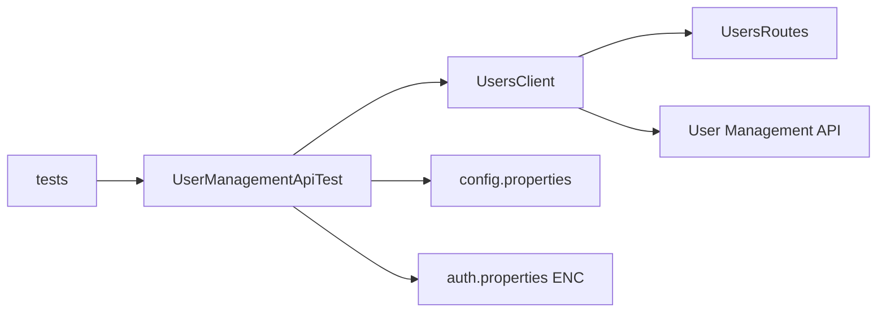

# User Management API — E2E Tests

Java 21 Maven project with TestNG, RestAssured, Allure, Lombok, Error Prone, PMD, and Spotless. Tests the User Management API in Docker using `ENC(...)` secrets, required `-Denv=DEV|PROD`, and optional `-DxmlFileName` for suite selection.

## Prerequisites

- **JDK 21** (recommended; enforcer allows 21+)
- Maven 3.9+
- Docker

Error Prone needs JDK compiler module exports. This repo includes [`.mvn/jvm.config`](.mvn/jvm.config) so Maven picks them up automatically. Prefer JDK 21:

```bash
export JAVA_HOME=$(/usr/libexec/java_home -v 21 2>/dev/null || echo /opt/homebrew/opt/openjdk@21/libexec/openjdk.jdk/Contents/Home)
export PATH="$JAVA_HOME/bin:$PATH"
export ENCRYPTION_MASTER_KEY='<your-master-key>'
```

`ENCRYPTION_MASTER_KEY` is required for every test run and for `CryptoSecretsCli` (no POM default). Use the same key that produced the committed `ENC(...)` values in `auth.properties`. CI injects it from the repository Actions secret `ENCRYPTION_MASTER_KEY` (value is not stored in this repo).

If you still see `IllegalAccessError` / Error Prone crashes on JDK 23+, either switch to JDK 21 or set the same flags via `MAVEN_OPTS` (see Error Prone [installation](https://errorprone.info/docs/installation)).

## Start the API

```bash
docker run -d --name user-management-api -p 3000:3000 \
  ghcr.io/danielsilva-loanpro/sdet-interview-challenge:latest
```

Verify with `curl http://localhost:3000/dev/users`.

## Encrypt a secret

```bash
mvn -s settings.xml -q -DskipTests compile
java -cp target/classes org.example.usermanagement.common.security.CryptoSecretsCli encrypt 'mysecrettoken'
```

Paste the `ENC(...)` output into `src/main/resources/auth.properties`:

```properties
DEV_AUTH_TOKEN=ENC(<generated>)
PROD_AUTH_TOKEN=ENC(<generated>)
```

## Quality gates

```bash
mvn -s settings.xml spotless:apply    # format
mvn -s settings.xml spotless:check    # format gate
mvn -s settings.xml pmd:check
mvn -s settings.xml -DskipTests test-compile
```

## Run functional tests

```bash
mvn -s settings.xml -Denv=DEV verify
mvn -s settings.xml -Denv=PROD verify
```

Allure writes a single-file report to `target/allure-report/index.html` after every `test` (and therefore `verify`) run, including when tests fail. The build still exits non-zero on failures.

TTFB tests are excluded from the default suite via `<exclude name="ttfb"/>` in `testng.xml`.

## Run TTFB tests

Local only or on-demand in GitHub Actions — **never on a PR**.

```bash
mvn -s settings.xml -Denv=DEV test -DxmlFileName=ttfb.xml
mvn -s settings.xml -Denv=PROD test -DxmlFileName=ttfb.xml
```

TTFB is not a merge gate. Persistent `GET /users` p90 failures are tracked as [BUG-005](docs/bugs/BUG-005-list-users-ttfb-exceeds-p90.md).

## Run from GitHub Actions

1. Open **Actions** → **E2E Tests**
2. Click **Run workflow**
3. Choose `environment` (`DEV` or `PROD`) and `xmlFileName` (`testng.xml` or `ttfb.xml`)

Pull requests automatically run quality gates plus parallel DEV and PROD functional tests. There is no `push` trigger.

**Expected red `test-dev` / `test-prod`:** those jobs assert OpenAPI-correct behavior against known API mismatches, so they often exit non-zero. That is intentional — failures map to tickets under [docs/bugs/](docs/bugs/). The `quality` job and the post-run `report` job (sticky PR comment + Allure on Pages) still succeed when tests fail.

### Reports in CI

- **Pull requests:** a sticky PR comment summarizes DEV/PROD Surefire results (counts + failing methods) and links to Allure on GitHub Pages:
  - `https://sg0nzalez.github.io/user-management-tests/prs/<PR_NUMBER>/dev/`
  - `https://sg0nzalez.github.io/user-management-tests/prs/<PR_NUMBER>/prod/`
- **On-demand runs:** the Actions job summary has the same Surefire summary; Allure is at  
  `https://sg0nzalez.github.io/user-management-tests/ondemand/<RUN_ID>/`
- Artifacts (`test-*-artifacts`) still upload Allure + Surefire for 7 days as a backup.

GitHub Pages must use **Settings → Pages → Deploy from a branch → `gh-pages` / (root)**. CI publishes under `prs/` and `ondemand/` on that branch.

## Documentation

- [docs/ARCHITECTURE.md](docs/ARCHITECTURE.md)
- [docs/TEST_STRATEGY.md](docs/TEST_STRATEGY.md)
- [docs/bugs/](docs/bugs/)
- [docs/sdet_challenge_api.yml](docs/sdet_challenge_api.yml)

## Layout



| Package | Role |
|---------|------|
| `common.config` | Environment, config/auth loaders, `BaseTest` |
| `common.security` | `CryptoSecrets`, `CryptoSecretsCli` |
| `common.api` / `common.http` | `BaseApiTest`, `ApiResponse` |
| `clients` / `routes` / `model` / `http` | API domain layer |
| `performance` | TTFB runner, probes, assertions |
| `tests` | TestNG test classes |

- **Env / secrets:** required `-Denv=DEV|PROD`; `auth.properties` uses `ENC(...)` (master key `ENCRYPTION_MASTER_KEY`).
- **Reports:** Allure single-file HTML at `target/allure-report/index.html` after `mvn test`. In CI, PRs get a sticky comment + Pages links; on-demand runs write the summary to the Actions job summary.
