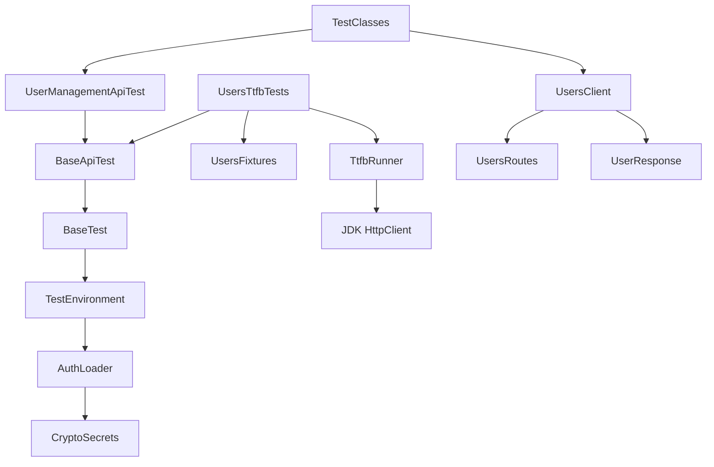
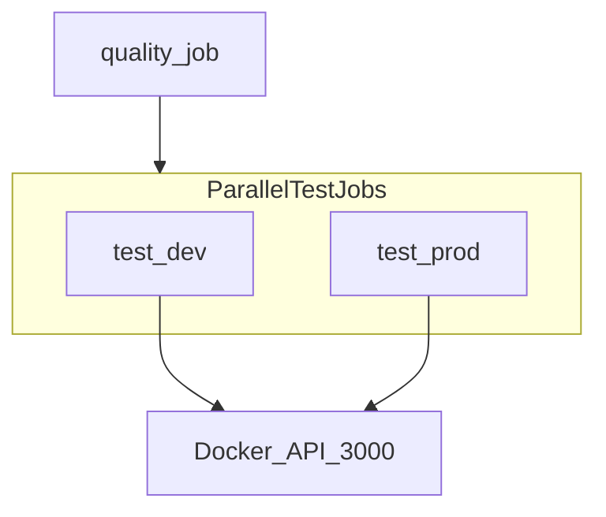

# Architecture

Structural design for the User Management API test project. For what is tested and why, see [TEST_STRATEGY.md](TEST_STRATEGY.md). For run commands, see [README.md](../README.md).

## System under test

The User Management API runs in Docker (`ghcr.io/danielsilva-loanpro/sdet-interview-challenge:latest`) on port 3000. It exposes identical endpoints under `/dev` and `/prod` path prefixes, each backed by an isolated database. The OpenAPI contract is [`sdet_challenge_api.yml`](sdet_challenge_api.yml).

| Method | Path | Auth | Status codes |
|--------|------|------|--------------|
| GET | `/{env}/users` | No | 200 |
| POST | `/{env}/users` | No | 201, 400, 409 |
| GET | `/{env}/users/{email}` | No | 200, 404 |
| PUT | `/{env}/users/{email}` | No | 200, 400, 404, 409 |
| DELETE | `/{env}/users/{email}` | `Authentication` header | 204, 401, 404 |

## Repository layout

Single Maven module (`org.example.usermanagement:user-management-tests`).

```
user-management-tests/
├── pom.xml
├── pmd-ruleset.xml
├── settings.xml
├── src/main/java/org/example/usermanagement/
│   ├── common/          # config loaders, security, http helpers
│   ├── routes/          # path fragments
│   ├── clients/         # RestAssured API clients
│   ├── model/           # User payload
│   ├── http/            # typed response wrappers
│   └── performance/     # TTFB framework
├── src/main/resources/
│   ├── config.properties
│   └── auth.properties  # ENC(...) tokens only (AES-256-GCM)
└── src/test/
    ├── java/.../common/ # BaseTest, BaseApiTest (TestNG lifecycle)
    ├── java/.../support/# fixtures + UserManagementApiTest
    ├── java/.../tests/  # TestNG test classes
    └── resources/
        ├── testng.xml   # functional suite (excludes ttfb)
        ├── ttfb.xml     # TTFB suite only
        └── allure.properties
```

## Layer diagram



## Functional test flow

1. Maven enforcer requires `-Denv=DEV|PROD` before tests run.
2. `testng.xml` (filtered) passes the `Environment` parameter to TestNG.
3. `BaseTest` / `TestEnvironment` load `config.properties` (base URLs) and `auth.properties` (encrypted tokens).
4. `BaseApiTest` configures RestAssured with JSON content type and the environment base URL.
5. Test classes call `UsersClient` methods annotated with Allure `@Step`.
6. Clients return typed wrappers (`UserResponse`, `UserListResponse`) extending `ApiResponse` for status and body assertions.

## TTFB flow

1. `UsersTtfbTests` extends `BaseApiTest` (not the functional domain base) and seeds fixtures via `UsersClient` + `UsersFixtures`.
2. Probe count comes from `TtfbConfig.defaults().getConcurrency()`.
3. `TtfbRunner` fires parallel probes via JDK `HttpClient.sendAsync`.
4. Each probe measures time until status and headers arrive (TTFB proxy).
5. `TtfbAssertions.assertSuccessful` attaches the report and asserts p90 + zero transport failures.
6. Default `testng.xml` excludes the `ttfb` group.
7. `ttfb.xml` includes only the `ttfb` group for local or on-demand runs.

## Configuration and secrets

| File | Purpose |
|------|---------|
| `config.properties` | `DEV_API_BASE_URL`, `PROD_API_BASE_URL` pointing to `localhost:3000` |
| `auth.properties` | `DEV_AUTH_TOKEN`, `PROD_AUTH_TOKEN` as `ENC(...)` ciphertext |
| `ENCRYPTION_MASTER_KEY` | Injected by Maven Surefire; CI supplies it from the repo Actions secret; decrypts tokens at runtime |

The master key is **not** the API token. Developers encrypt the challenge token once with `CryptoSecretsCli`, commit only `ENC(...)` values, and run tests without exporting plaintext secrets.

## CI architecture



| Trigger | Jobs | Suite |
|---------|------|-------|
| `pull_request` | quality → parallel test-dev + test-prod | `testng.xml` (TTFB excluded) |
| `workflow_dispatch` | quality → test-ondemand | chosen env + suite |

No `push` trigger — the PR is the merge gate. On-demand dispatch allows choosing `DEV`/`PROD` and `testng.xml`/`ttfb.xml`.

## Quality toolchain

| Tool | Role |
|------|------|
| Spotless + google-java-format | Code formatting |
| PMD | Static analysis via `pmd-ruleset.xml` |
| Error Prone | Compile-time bug detection (JDK 21 module exports via `.mvn/jvm.config`) |
| Maven Enforcer | Java 21+ and required `-Denv` |
| Allure | Test reporting with single-file HTML output |

Command details are in [README.md](../README.md).

## Extension points

| Add… | Where |
|------|-------|
| New endpoint path | `UsersRoutes` |
| New API operation | `UsersClient` method + response wrapper |
| New test scenarios | Test class under `org.example.usermanagement.tests` |
| New TTFB probe | Method in `UsersTtfbTests` using `TtfbRunner` |

Register new test classes in `testng.xml` (functional) or ensure they carry the `ttfb` group for the TTFB suite.
